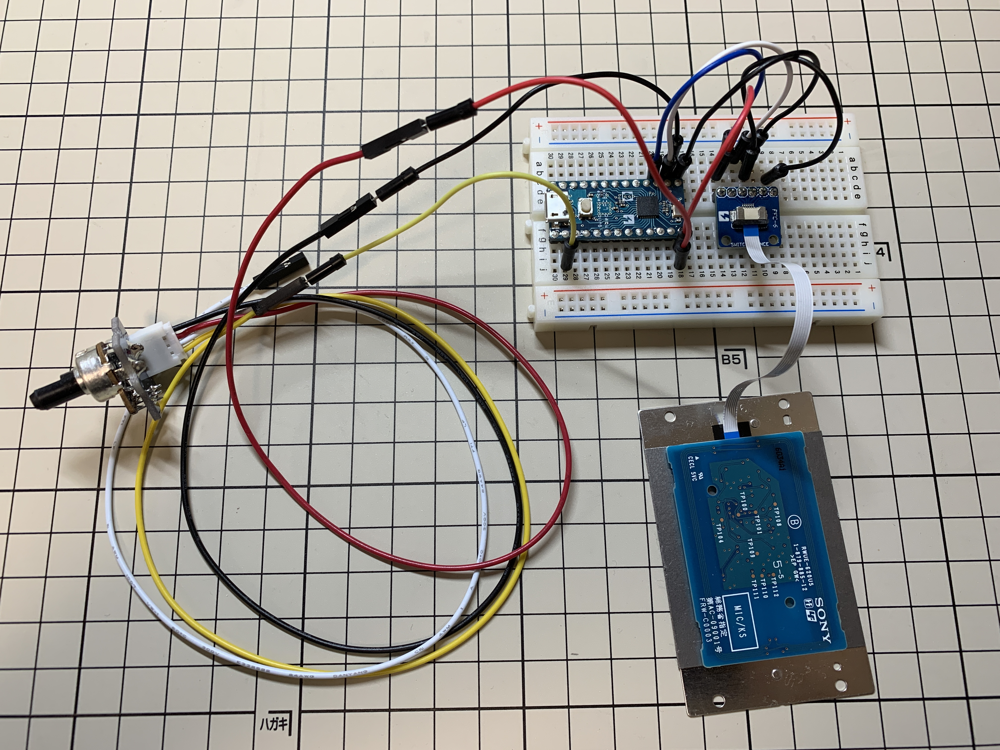

# PIICA 発光テストプログラム

RC-S620/S FeliCaカードリーダーを使って、PIICAのLED点灯をテストするプログラムです。

## 使用機材

* RC-S620/S FeliCaカードリーダー（dp16, dp15に接続）
* Switch Science mbed LPC824
* Seeed Grove rotary angle sensor v1.2 （dp2に接続）

## 接続図

